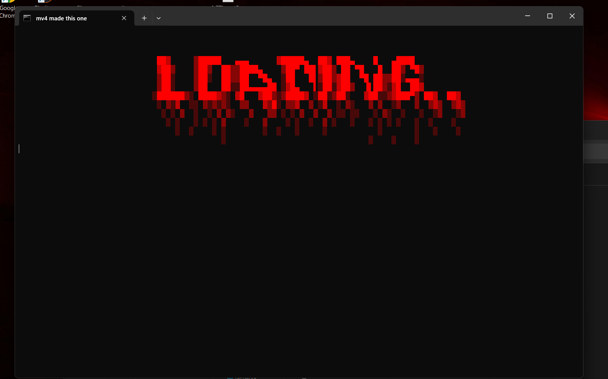

# mkz 💻

mkz is a lightweight command-line tool designed to simplify and automate tasks on windows systems.  
it runs directly through a `.bat` file, making setup fast and hassle-free.  
‎ ‎ 
‎ ‎ 
‎ ‎ 
# requirements 📜
- Windows 11 operating system  
‎ ‎ 
‎ ‎ 
‎ ‎ 
# installation 📖
- go to main page of this script and press code, download as zip.
- once downloaded, unzip
- run .bat
- wait for libaries to install
- after everything downloads, the termainal should pop up with the tool
- enjoy!
‎ 
‎ ‎ ‎ 
‎ ‎ 
# usage 👤
- run the tool by executing the batch file:
  mkz-tool.bat
‎ ‎ ‎ 
‎ ‎ 
‎ ‎ 
# WARNING: ⚠️
do not start the .py by a ide. libaries will not install and time gets wasted.
‎ ‎ 
‎ ‎ 
‎ ‎ 
# documentation 🧑‍🏫
- see mv4zz on discord for detailed usage instructions and better analyis of this script 🪄
‎ 
‎ 
‎ 
# screenshots 📷
- example interface:
  
  
